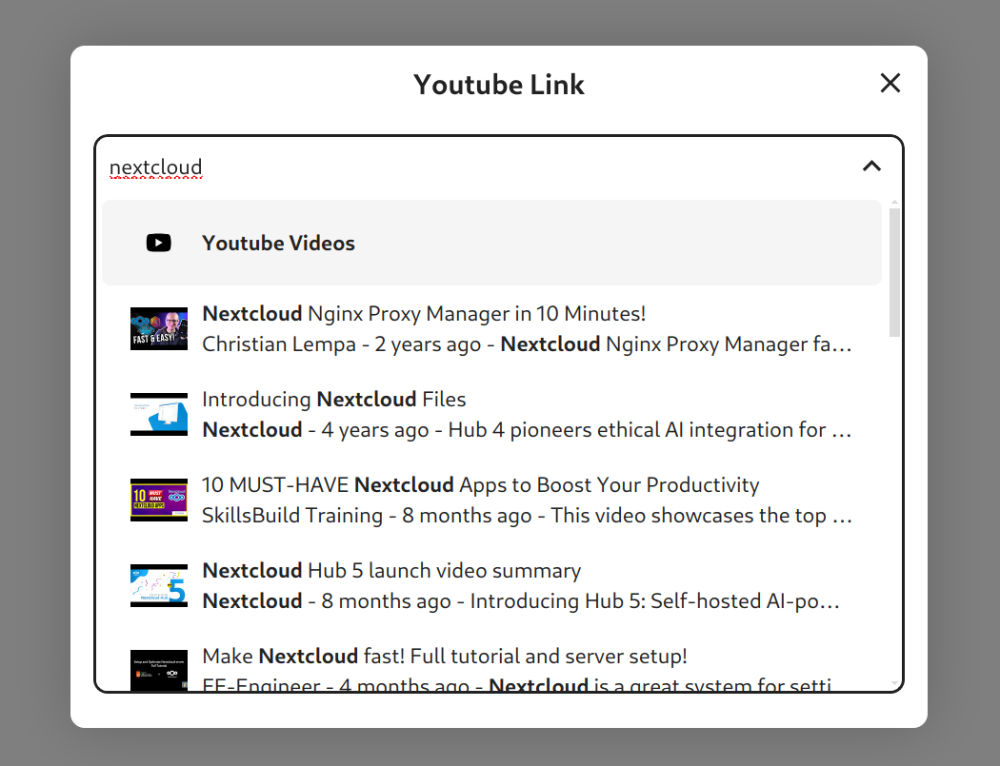

# YouTube Integration

YouTube Integration providing an inline video player for link previews, a smart picker and search provider for searching YouTube videos, channels, and playlists.

## Configuration

Set an API key in the Administration settings -> Connected Accounts -> YouTube Integration section to allow the search and smart picker

Note: The search and smart picker functionality is disabled by default. Users can opt-in to enable them from their respective settings.

## Screenshots

Smart Picker

Unified Search

Reference Provider

